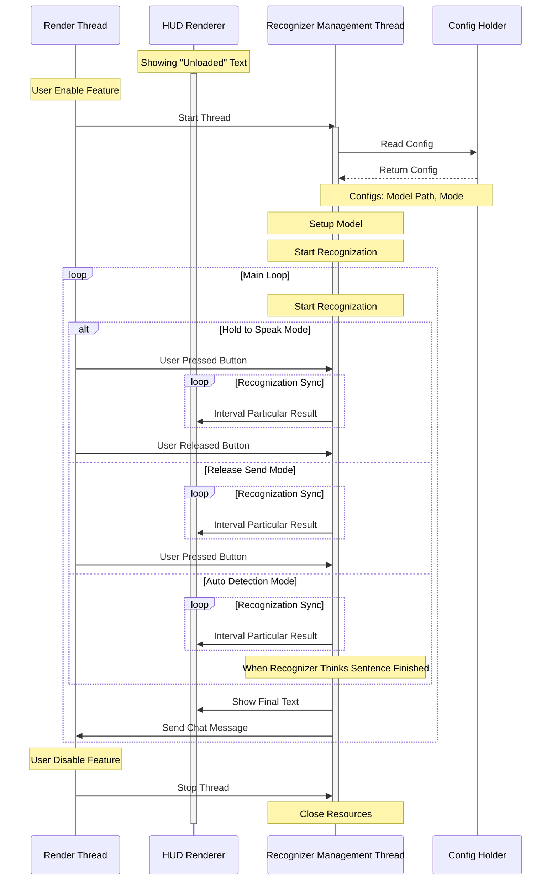

# Simple Text Chat 简单的文本聊天

一个简单的mod，通过语音转写让你可以边玩边用语音聊天。

A simple mod that allows you to chat with voices while playing by recognize your voice to chat messages.

### Intention 初衷

> “你可以一边玩一边说话，但不可以一边玩一边打字。”
> 
> —— Yuang2714在一个没有语音聊天的Minecraft服务器中的讲话
> 
> "You can speak while playing, but you can't type while playing." 
> 
> —— Yuang2714's speech on a Minecraft server that has not Simple Voice Chat installed
>
> 

### Vosk lib Usage

本项目使用Vosk作为语音转写引擎，它使用Apache-2.0许可。

This project uses Vosk as recognization engine, which uses Apache-2.0 license.

### Recognizer Lifecycle 转写器的生命周期

